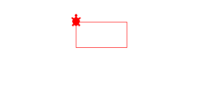

# Day-18 of 100

Learnt about Turtle graphics

```
import Turtle
```

implemented a simple rectangle



learnt how to extract color from image


```
import colorgram

colors = colorgram.extract('image.jpg', 30)
rgb_colors = []

for color in colors:
    r = color.rgb.r
    g = color.rgb.g
    b = color.rgb.b
    new_color = (r, g, b)
    rgb_colors.append(new_color)

print(rgb_colors)
```