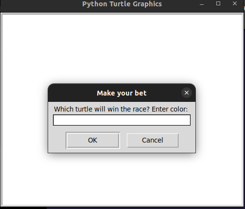

# Day-19 of 100

implemented a turtle racing game




Concepts used:-

- Object oriented programming

  - used Turtle, Screen and random classes

  ```python
  from turtle import Turtle, Screen
  import random
  ```

  - created objects for each class multiple times

  ```python
  new_turtle = Turtle(shape="turtle")
  screen = Screen()
  ```

  - used object methods

  ```python
  new_turtle.penup()
  ```
